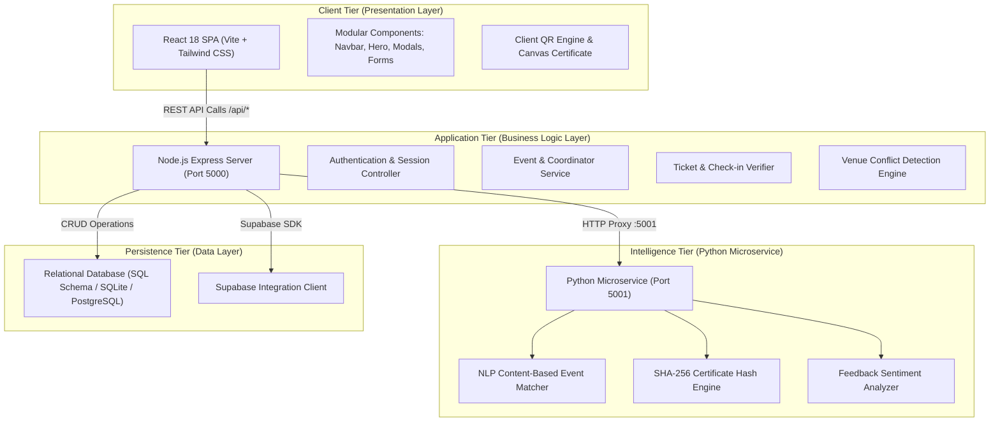

# System Architecture Design Document
## Smart College Event Management System (Smart CEMS)

```mermaid
flowchart TD
  subgraph Client_Tier["Client Tier (Presentation Layer)"]
    ReactUI["React 18 SPA (Vite + Tailwind CSS)"]
    Components["Modular Components: Navbar, Hero, Modals, Forms"]
    QRCodeEngine["Client QR Engine & Canvas Certificate"]
  end

  subgraph Application_Tier["Application Tier (Business Logic Layer)"]
    NodeAPI["Node.js Express Server (Port 5000)"]
    AuthModule["Authentication & Session Controller"]
    EventModule["Event & Coordinator Service"]
    RegistrationModule["Ticket & Check-in Verifier"]
    VenueGuard["Venue Conflict Detection Engine"]
  end

  subgraph AI_Tier["Intelligence Tier (Python Microservice)"]
    PythonService["Python Microservice (Port 5001)"]
    NLPRecommender["NLP Content-Based Event Matcher"]
    CryptoVerifier["SHA-256 Certificate Hash Engine"]
    SentimentAnalyzer["Feedback Sentiment Analyzer"]
  end

  subgraph Data_Tier["Persistence Tier (Data Layer)"]
    SQLRelational["Relational Database (SQL Schema / SQLite / PostgreSQL)"]
    SupabaseCloud["Supabase Integration Client"]
  end

  ReactUI -->|REST API Calls /api/*| NodeAPI
  NodeAPI -->|CRUD Operations| SQLRelational
  NodeAPI -->|Supabase SDK| SupabaseCloud
  NodeAPI -->|HTTP Proxy :5001| PythonService
  PythonService --> NLPRecommender
  PythonService --> CryptoVerifier
  PythonService --> SentimentAnalyzer
```
